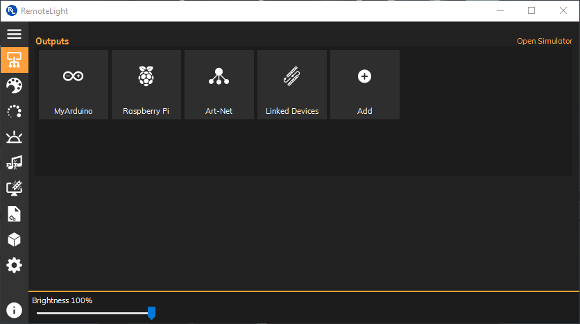
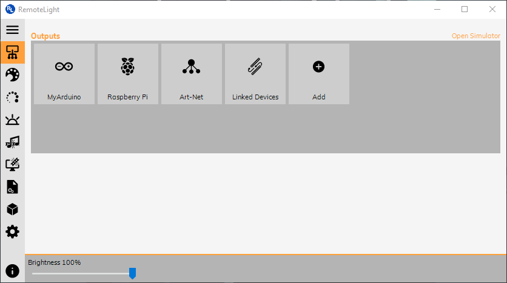
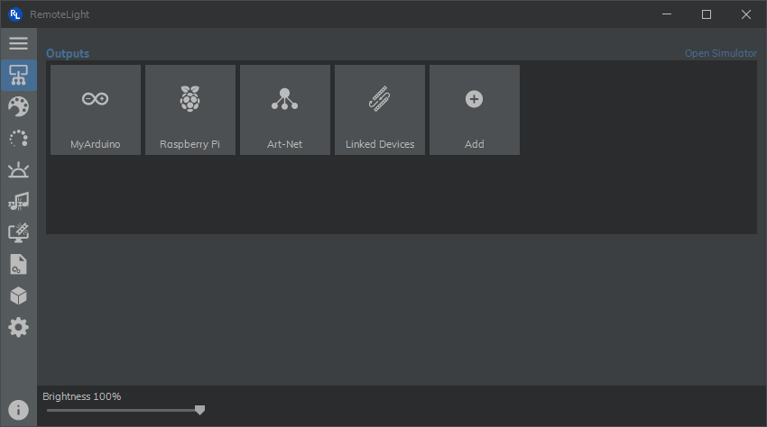
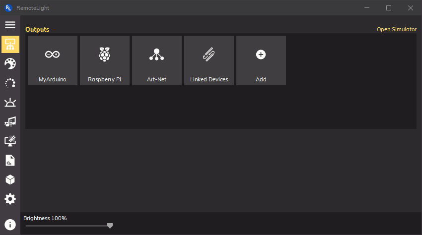
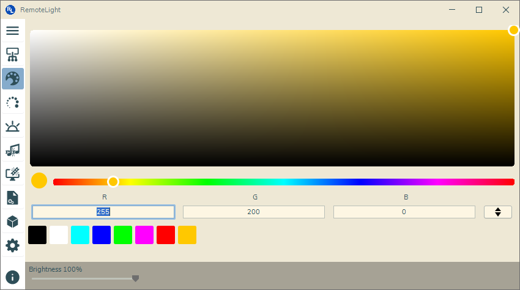
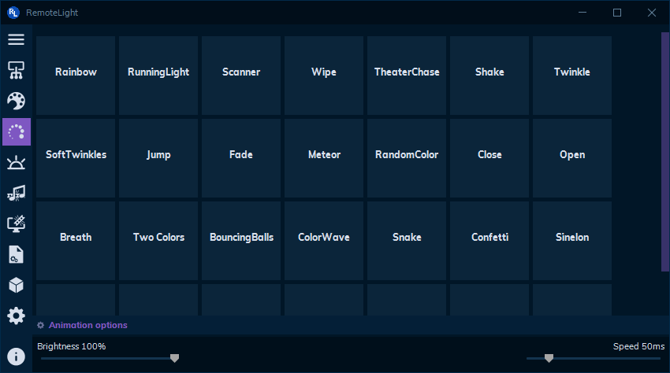
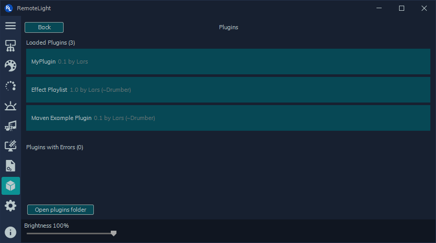
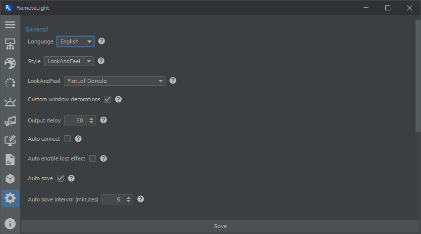

# RemoteLight v0.2 - Multifunctional LED Control Software

RemoteLight is a Java based control software for WS2811/WS2812 (aka Neopixel) and some other addressable LED strips. It offers a modern, user-friendly UI and a lot of features.

   
 

## Features
- Easy to use
- Supports **Arduino** and **Raspberry Pi**
- Artnet output
- Custom colors
- Animations
- Scenes
- Music reactive effects / Visualizer
- Ambilight
- Lua scripts
- Custom Java Plugins
- Neopixel simulator

## Table of contents
* [Hardware](#hardware)
* [Software](#software)
* [Downloads](#downloads)
* [Quick Start](#quick-start)
  * [Arduino](#arduino)
  * [Raspberry Pi](#raspberry-pi)
  * [Simulator](#simulator)
* [Lua scripts](#lua-scripts)
* [Start parameters](#start-parameters)
* [Commands](#commands)
* [Plugins](#plugins)
* [Images](#images)

## Hardware
- Windows/Linux/MacOS computer (not required when using Raspberry Pi)
- Arduino or Raspberry Pi
- WS2811, WS2812(B) or similar LED strip

## Software
- [Java](https://java.com)
- [RemoteLight](https://github.com/Drumber/RemoteLight/releases)
- [RemoteLightServer](https://github.com/Drumber/RemoteLightServer/releases) (is required when using a Raspberry Pi)

## Downloads
- :diamond_shape_with_a_dot_inside: [RemoteLight](https://github.com/Drumber/RemoteLight/releases)  
- :large_orange_diamond: [RemoteLightServer](https://github.com/Drumber/RemoteLightServer/releases)  
- :large_blue_diamond: [RemoteLightWeb](https://github.com/Drumber/RemoteLightWeb/releases)  

## Quick Start
### Arduino
*[Youtube Tutorial available](https://youtu.be/1jguUgaUdNk)*  | *[view Wiring Guide](https://github.com/Drumber/RemoteLight/wiki/Arduino-Wiring)*

RemoteLight uses the Glediator protocol for Arduino. Download the [Glediator sketch](http://www.solderlab.de/index.php/downloads/file/33-ws2812-glediator-interface-v1), change the number of pixels and upload it to your Arduino.
> Note: Solderlab.de seems to be offline. You can alternatively download the sketch [here](https://workupload.com/file/vsSx8TBP) or use the [FastLED](https://github.com/marmilicious/FastLED_examples/blob/master/Glediator_test1.ino) variant.

Connect the Arduino to your computer and start RemoteLight. Click '*Add*' to add a new Arduino to the output list. Then select the correct COM port, enter the number of pixels and click '*Save*'.
Now you can activate the output by double clicking on it or by clicking on '*Activate*'.

### Raspberry Pi
*[Youtube Tutorial available](https://youtu.be/3NTMhhIGqto)*  | *[view Wiring Guide](https://github.com/Drumber/RemoteLight/wiki/Raspberry-Pi-Wiring)*  
[RemoteLightServer repository](https://github.com/Drumber/RemoteLightServer)

First of all your Raspberry Pi must be prepared to control WS2811/WS2812 LEDs. There is a well described tutorial on tutorials-raspberrypi.com. [**> Tutorial <**](https://tutorials-raspberrypi.com/connect-control-raspberry-pi-ws2812-rgb-led-strips/)  
After everything works, you can move on.  
Upload the [RemoteLight-Server.jar](https://github.com/Drumber/RemoteLightServer/releases) onto your Raspberry Pi and start it:
1. Connect to your Raspberry Pi via SSH.
2. Install Java: `sudo apt-get install oracle-java8-jdk`
3. Navigate to the directory where the RemoteLight-Server.jar is located, e.g.: `cd /home/pi/`
4. Start the server: `sudo java -jar RemoteLightServer-pre0.2.0.8.jar`
5. To stop the server: Type `end` or press `Ctrl + c`

Now start RemoteLight on your computer and click on '*Add*' > '*RLServer (Raspberry)*'. Enter the IP address of the Raspberry Pi in the '*Hostname / IP*' field (the Raspberry Pi must be on the same network).
Enter the number of pixels and click 'Save'. If the server is running, you can click on '*Activate*'.
> Note: You can also use the Raspberry Pi without an additional computer. For this you need an OS with a graphical desktop installed on the Raspberry Pi. Start the server (as described above) + the RemoteLight control software, add a new 'RLServer (Raspberry)' output and enter 'localhost' or '127.0.0.1' in the 'Hostname / IP' field.

#### Start server automatically on startup
*[Youtube Tutorial available](https://youtu.be/FYeQfIqytx4)*

1. Install screen: `sudo apt-get install screen`
2. Edit root startup script: `sudo nano /etc/rc.local`
3. Insert the following line before '*exit 0*':  
`su - pi -c "screen -dm -S [name] sudo java -jar /path/to/RemoteLightServer.jar"`
4. Edit the name of the screen and the file path, e.g.:  
*`su - pi -c "screen -dm -S remotelight sudo java -jar /home/pi/RemoteLightServer-pre0.2.0.8.jar"`*

The RemoteLightServer will now start automatically in a new screen when booting.  
To open the screen use `screen -r [name]`. Type `end` or press `Ctrl + C` to stop the server. To leave the screen press `Ctrl + A and D`.

### Simulator
RemoteLight comes with a LED strip simulator in which you can test the effects without a WS2811/WS2812 strip. However, the effects look a thousand times better with a real LED strip 😉.  
To use the simulator you need to go to the output menu and click on '*Open simulator*' in the upper right corner.  
A new window will open. Click on '*Enable*' to activate the simulator. Now go back to the output menu and add a new '*RLServer (Raspberry)*' output. Enter `localhost` or `127.0.0.1` as hostname / IP and the number of pixels you want to simulate. Then click on '*Save*' and activate the output.

## Lua scripts
With the latest update it is possible to write animations in Lua. All Lua files located in ``C:\Users\[user]\.RemoteLight\lua_scripts`` (``/home/[user]/.RemoteLight/lua_scripts`` on Linux) are listed in the 'Scripts' menu.  
```
Methods:
strip.ledNumber()                   Returns the LED number of the current strip
strip.show(table{table{r,g,b}})     Shows the colors in the table on the strip
                                    Expects a table with RGB values in a table which is as long as the  led strip
                                    e.g.: {{255, 0, 0}, {250, 15, 0}, {0, 255, 255}, ...}
 		                                   \ 1. LED  /  \ 2. LED   /   \ 3. LED   /  ...
strip.delayReached()                Returns true when the user defined delay/speed is reached
strip.setAll(table{r,g,b})          Sets the entire strip to the given color
strip.setPixel(led, table{r,g,b})   Sets the color of a single pixel
strip.shiftRight(x)                 Shift all colors on the strip x times to the right
strip.shiftLeft(x)                  Shift all colors on the strip x times to the left
strip.shiftOutwards(x)              Shift all colors on the strip x times from the centre outwards
strip.randomColor()                 Returns a random color (a table with an RGB value)

colorUtil.rainbowWheel(hue)         Hue should be in the range from 0 to 360
colorUtil.hsv(hue, saturation, brightness)
colorUtil.rgb(red, green, blue)     Builds a table with the given RGB values
colorUtil.[RED(), GREEN(), BLUE(), BLACK(), WHITE(), CYAN(), ORANGE(), YELLOW(), MAGENTA(), PINK()]
```

## Start parameters
```
java -jar RemoteLight-pre0.2.0.x.jar [paramaters...]
-tray | -t               start minimized in the system tray
-autoconnect | -ac       automatically connect to last used output
-updatechecker | -uc     check for updates
```

## Commands
Since RemoteLight v0.2.1 you can control animations/effects from the console.
```
start <AnimationManager/MusicSyncManager/SceneManager/LuaManager> <animation/effect/script path>
stop <all/AnimationManager/MusicSyncManager/SceneManager/LuaManager>
color <HEX> or color <r> <g> <b>
list [<AnimationManager/MusicSyncManager/SceneManager>]
close
```

## Plugins
> More plugins and info material about creating own plugins will come soon

[View here for example plugins](https://github.com/RemoteLight/PluginExamples)  
Recommend plugin:  
 \> [Effect Playlist](https://github.com/RemoteLight/PluginExamples/tree/master/EffectPlaylist): create automatic effect sequences

## Images
 

Supports a bunch of different theme combinations, thanks to the [FlatLaf LookAndFeels](https://github.com/JFormDesigner/FlatLaf).
 
 

## Video Demo
<a href="https://www.youtube.com/watch?v=u8ptqaTGteg"></a>  <a href="https://www.youtube.com/watch?v=-5hKRAyPDT8"></a>

## Changelog
[Changelog of all versions since v0.1.1](./CHANGELOG.md)

## License
RemoteLight is released under the [GNU General Public License v3.0](https://github.com/Drumber/RemoteLight/blob/master/LICENSE).
